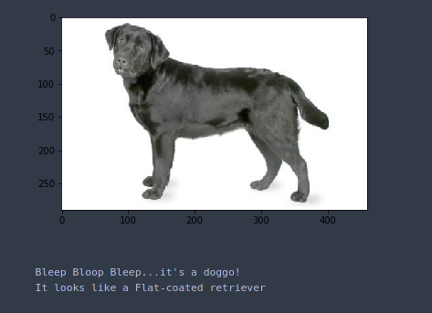
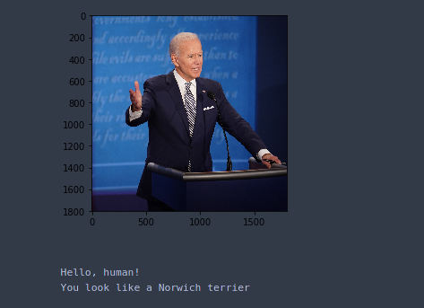

## Project Overview

In this notebook, I will make the first steps towards developing an algorithm that could be used as part of a mobile or web app.  At the end of this project, this code will accept any user-supplied image as input.  If a dog is detected in the image, it will provide an estimate of the dog's breed.  If a human is detected, it will provide an estimate of the dog breed that is most resembling.  The image below displays the output of the finished project:





In this real-world setting, we will need to piece together a series of models to perform different tasks; for instance, the algorithm that detects humans in an image will be different from the CNN that infers dog breed.  There are many points of possible failure, and no perfect algorithm exists.  My imperfect solution will nonetheless be a fun experience!

### Environment requirements:
1. pytorch (preferable to have cudatoolkit installed)
2. opencv-python
3. tqdm
4. numpy
5. matplotlib

1. Clone the repo
	``` 
		git clone https://github.com/coddiw0mple/doggoDetector.git
	```
2. Download the [dog dataset](https://s3-us-west-1.amazonaws.com/udacity-aind/dog-project/dogImages.zip).  Unzip the folder and place it in the repo, at location `path/to/dog-project/dogImages`.  The `dogImages/` folder should contain 133 folders, each corresponding to a different dog breed.
3. Download the [human dataset](http://vis-www.cs.umass.edu/lfw/lfw.tgz).  Unzip the folder and place it in the repo, at location `path/to/dog-project/lfw`.   
4. Make sure you have already installed the necessary Python packages according to the Environment requirements in the Readme.MD file.
5. Open a terminal window and navigate to the project folder. Open the notebook and follow the instructions.
	
	```
		jupyter notebook dog_app.ipynb
	```

